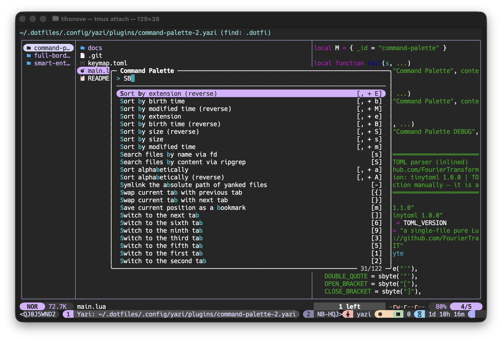

# command-palette-2.yazi

A command palette plugin for [Yazi](https://yazi-rs.github.io/) — fuzzy-search and execute any keybinding right from an interactive overlay, inspired by VS Code's `Ctrl+Shift+P`.



## Features

- **Built-in modal UI** — no external dependencies required; renders a floating overlay directly inside Yazi with a search input, fuzzy-filtered results list, and keyboard navigation.
- **Fuzzy matching** — VSCode-style scoring with CamelCase / word-boundary bonuses; matches are highlighted in the results.
- **Reads your keymap automatically** — parses `~/.config/yazi/keymap.toml` and any TOML files bundled with the plugin to collect every available command with its description and key binding.
- **Three interface modes:**
  - **modal** (default) — native Yazi overlay, zero dependencies.
  - **fzf** — delegates to [fzf](https://github.com/junegunn/fzf) for those who prefer it.
  - **builtin** — lightweight `ya.which`-based picker (limited to 36 items).

## Requirements

- [Yazi](https://yazi-rs.github.io/) ≥ 25.2
- *(optional)* [fzf](https://github.com/junegunn/fzf) — only needed if you want to use the `fzf` mode.

## Installation

### Using `ya pack`

```sh
ya pack -a tihonove/command-palette-2
```

### Manual

Clone the repository into your Yazi plugins directory:

```sh
# macOS / Linux
git clone https://github.com/tihonove/command-palette-2.yazi \
  ~/.config/yazi/plugins/command-palette-2.yazi
```

## Setup

Add a keybinding to your `~/.config/yazi/keymap.toml` to open the palette.

### Modal mode (recommended, no dependencies)

```toml
[[manager.prepend_keymap]]
on   = "<C-p>"
run  = "plugin command-palette-2"
desc = "Open command palette"
```

### fzf mode

```toml
[[manager.prepend_keymap]]
on   = "<C-p>"
run  = "plugin command-palette-2 fzf"
desc = "Open command palette (fzf)"
```

### builtin mode

```toml
[[manager.prepend_keymap]]
on   = "<C-p>"
run  = "plugin command-palette-2 builtin"
desc = "Open command palette (builtin)"
```

## Usage

1. Press the configured key (e.g. `Ctrl+P`).
2. Start typing to fuzzy-filter commands by description or key binding.
3. Use `↑` / `↓` (or `Ctrl+P` / `Ctrl+N`) to navigate, `PageUp` / `PageDown` for fast scrolling.
4. Press `Enter` to execute the selected command.
5. Press `Esc` or `Ctrl+C` to dismiss.

## Bundled keymap

The plugin ships with a `keymap.toml` that contains a broad set of default Yazi keybindings so the palette is useful out of the box. Commands from your personal `~/.config/yazi/keymap.toml` are loaded as well and take priority in the list.

## License

MIT
